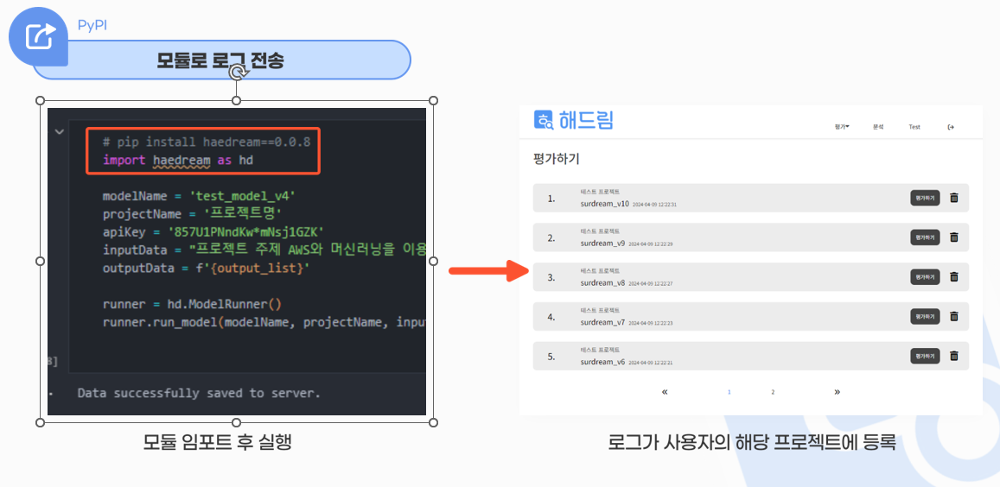
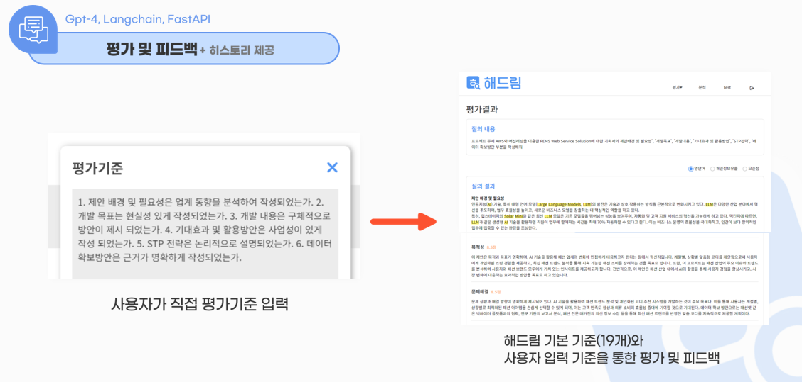
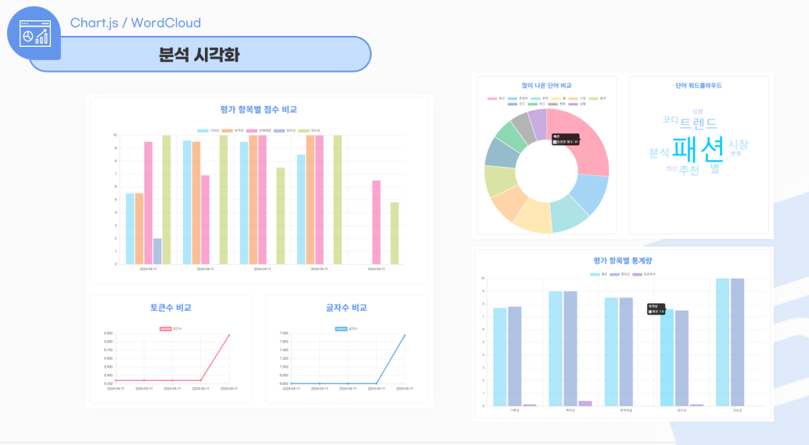
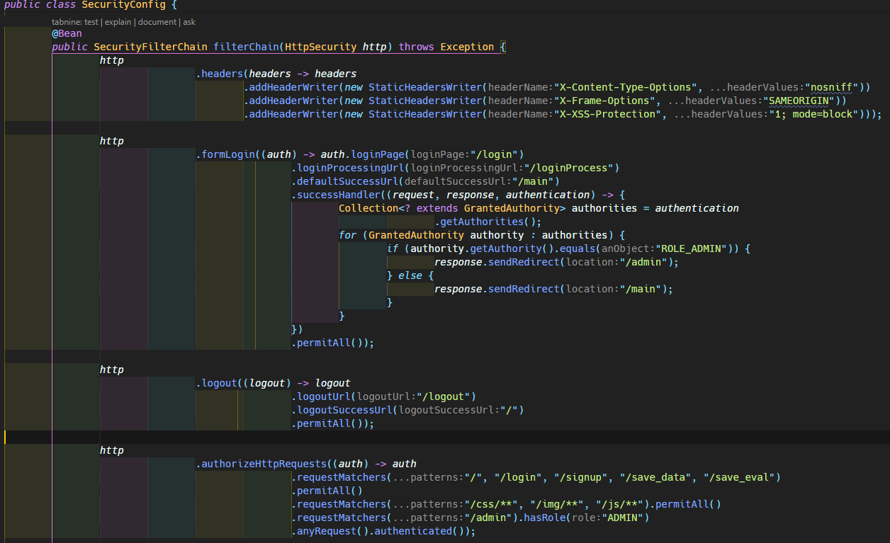
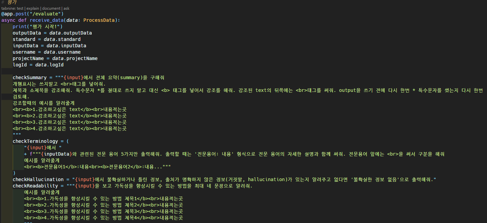
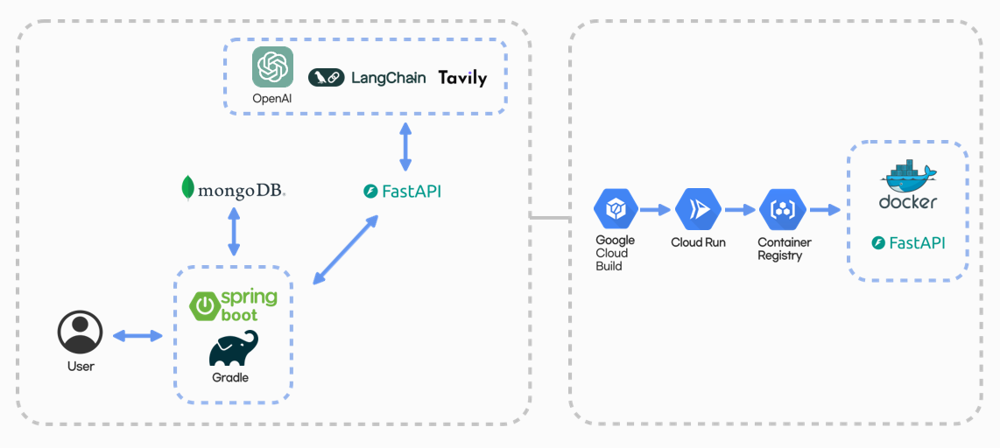

# 👨‍👨‍👧‍👦 웹사이트 기반 작문 LLM 서비스 평가•개선도구 <해드림> 👨‍👨‍👧‍👦

개발 일정 : **2024.03.15 ~ 2024.04.15**

사용언어 :     

사용 프레임워크 & 라이브러리 :     

사용 API :    GPT4, LangChain   

> 주제만 입력하면 기획서를 생성해주는 써드림! 👉 [해드림 바로가기](https://haedream-pafljma3ia-du.a.run.app)   

   

## 📃 Description
작문 LLM 서비스의 결과물을 평가,개선 할 수 있는 해드림입니다.  
모듈을 사용해 생성형 모델의 결과를 받아와 사용자가 설정한 평가기준과 해드림의 평가지표를 기준으로 평가 한 뒤,점수와 피드백을 제공합니다.   최근 5건의 평가결과를 모아 그래프로 시각화까지 해줍니다!

## Demo
  
  
  
  
  

## ⭐ Main Feature
### 모듈로 로그 전송
  - PyPI로 제작한 모듈을 통해 생성형 모델의 인풋데이터, 아웃풋데이터, 모델이름, 프로젝트 이름, api-key 정보 해드림으로 전송
### 평가 및 피드백
  - 사용자의 평가기준과 해드림의 평가지표를 기준으로 평가해 점수화와 피드백 제공 (히스토리 기능 제공)
### 분석 시각화
  - 최근 결과 5건을 모아 Chart.js로 시각화하여 제공
### 챗봇
  - 챗봇을 이용해 사용 가이드 제공

## 🔨 Server Architecture

